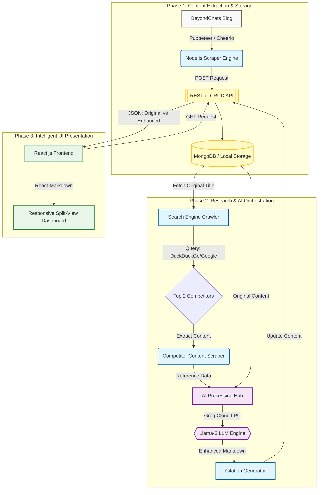

This is a comprehensive and high-impact README designed to impress evaluators. It highlights your technical depth, the complexity of the pipeline you've built, and provides clear instructions for anyone reviewing your work.

---

# AI-Powered Content Intelligence & Enhancement Pipeline

An automated end-to-end system that scrapes legacy blog content, performs competitive research via search engines, and leverages Large Language Models (LLMs) to reformat and enhance articles for better readability and SEO alignment.

## 🚀 Overview

This project is a three-phase full-stack application designed to modernize web content. It automates the "Research-to-Publish" workflow by:

1. **Extracting** historical data from target blogs.
2. **Analyzing** top-ranking competitors on search engines for the same topics.
3. **Synthesizing** new content using the Groq LPU (Llama-3 models) to match modern formatting and depth.
4. **Presenting** a side-by-side comparison in a responsive React interface.

---

## 🏗️ System Architecture & Data Flow

The system follows a modular pipeline architecture. Below is the flow of data through the various phases:



---

## 🛠️ Tech Stack

* **Frontend:** React.js, React-Markdown (for AI formatting), CSS3 (Split-view Grid).
* **Backend:** Node.js, Express.js.
* **AI Engine:** Groq Cloud API (Llama-3-70b/8b).
* **Scraping:** Cheerio / Axios / Search APIs.
* **Database:** Local JSON Storage / RESTful CRUD implementation.

---

## ⚙️ Local Setup Instructions

### 1. Prerequisites

* Node.js (v16 or higher)
* A **Groq API Key** (Get it at [console.groq.com](https://console.groq.com/))

### 2. Backend Installation

```bash
# Navigate to the backend directory
cd backend

# Install dependencies
npm install

# Create a .env file
touch .env

```

Add the following to your `.env`:

```env
GROQ_API_KEY=your_key_here
PORT=5000

```

### 3. Running the Pipeline

To initiate the full scraping, searching, and AI enhancement process:

```bash
# Run the development server
npm run dev

# In a separate terminal, start the pipeline (if scripted as a separate entry)
npm start

```

### 4. Frontend Installation

```bash
# Navigate to the frontend directory
cd frontend/article-app

# Install dependencies
npm install

# Start the React app
npm run dev

```

---

## 📑 Detailed Phase Breakdown

### Phase 1: Legacy Scraping

* Scrapes the 5 oldest articles from `beyondchats.com/blogs/`.
* Implements full CRUD (Create, Read, Update, Delete) endpoints to manage article objects.

### Phase 2: Competitive Intelligence & LLM

* **Dynamic Search:** Takes the title of the original article and queries search engines for current top-performing blogs.
* **Competitor Analysis:** Scrapes the content of those top results to understand the current "standard" of information.
* **LLM Enhancement:** Prompts the LLM to rewrite the original content, adopting the professional tone and formatting of the top-ranking results while retaining the core message.
* **Citations:** Automatically appends the source links used for research at the bottom of the article.

### Phase 3: Comparison UI

* A "Dashboard" view to select processed articles.
* A "Comparison" view featuring:
* **Left Pane:** Original raw text with metadata.
* **Right Pane:** Markdown-rendered enhanced content with specialized styling for readability.


---

## 🔗 Demo

* **API Documentation:** `http://localhost:5000/api/articles`

---

## 👤 Author

* **Arpit Karn**
